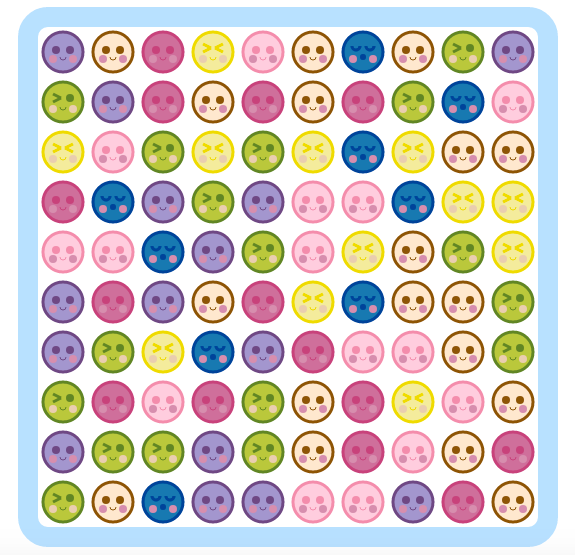

# Mochi Mochi

Play [Mochi Mochi][website] !

[website]: https://scottheng.github.io/mochimochi

	

Mochi Mochi is an tile-matching arcade game inspired by Bejeweled and Candy Crush. The goal of the game is to connect 3 or more of the same colored mochis. The more you connect, the higher you score! It's a race against the clock to see how many points you can score.

## Features and Implementation

## Future Direction

